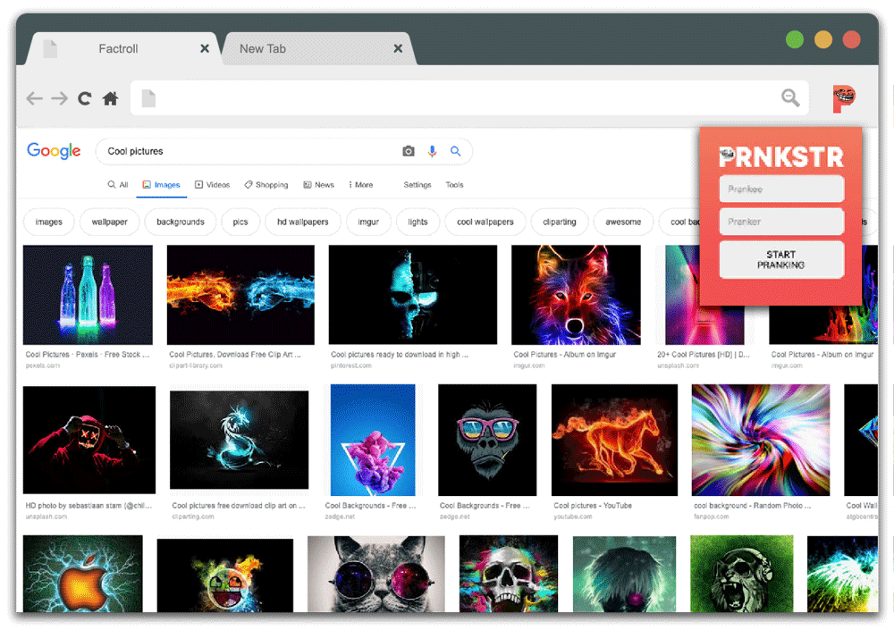

# Prnkstr — A DOM manipulating Chrome extension.

### General Assembly SEI31

### **About Prnkstr**

The goal of this collaborative project was to build a Chrome Extension allowing a pranker to remotely carry out a prank on their chosen prankee by manipulating their DOM, and therefor disrupting their browsing experience.

Once installed, Prnkstr allows you to easily name and setup up a link between a prankee's Chrome browser and assign it to your *master* account. Prnkstr then runs in the background, and upon a each page reload receives the (harmless) DOM manipulation instructions from a remote database, where the pranker can choose enable or disable many features such as replacing all images from FillMurray.com, change all instances of *is* to *isn't* or even something as simple as wrapping all paragraph elements in a <marquee.> tag, bringing back some happily forgotten 90s web design memories.

Prnkstr itself will likely never make the Chrome Extension app store because it fundamentally breaks some of terms required to be posted to the store, though the team behind Prnkstr is hoping to adjust our codebase to adhere with these in the future, where we will try again.

Between Prnkstr's three collaborators ([Thomas Hexton](https://github.com/thomashexton) and [Adlan Elias](https://github.com/adlanelias)) the decision was made to build a backend API using Ruby on Rails and build our frontend control panel with React, in an effort to grow our familiarity with it.

### **Learnings**
Getting the Chrome Extension to run successfully and repetitively ping our Rails API when we needed it to was by far the most challenging part. However, through careful study of Google's extensive Chrome docs, I build a strong understanding of the interplay between an Extension's *manifest.json*, *content.js* & *background.js* scripts. Each of these scripts run in their own environment, so to get data to pass between these required using Chrome's API methods for sending messages between these different environments/scripts.

Organising the data to flow at the required moments meant setting up event listeners on things like creation of a new tab or a page reload and then *messaging* the newly created/active tab with the JSON response from our API, which housed the DOM manipulation instructions.

Finally, it was a matter of setting up a setTimeout() function on page load, recursively calling itself waiting for the JSON object containing manipulation instructions to come through and turn on/off the pranker's chosen pranks.

Of course, any web app needs a database and this project had 2 databases. One model was focused solely on the one-to-many relationship of a pranker and their prankees. We wanted to allow a pranker to have many different prankee's, but also allow each prankee to have unique feature control. The second model housed each of the prankee's DOM manipulation values, some of them as simple as a boolean value while others offered some more complex parameters. However, in the future if more features are added I would like to serialise the database so that each feature will only have a single column, regardless of how complex it's parameters might get.

I learned that communication is key. I worked closely with my team over the weekend in the same file getting chrome extension to ping the database and pass data into the window.

Once we had the app working our team and I managed to add another 5 features on the final day and I managed to get all the CSS done for the final page done too.

Ultimately as a proof of concept this app works, however I would love to migrate everything to firebase and secure the app.

### **How does it work?**
You can find the dashboard of the *Prnkstr extension* at;
https://thomashexton.github.io/prnkstr-client/#/

#### Setting up a Prnkstr link.

#### Prnkstr Dashboard Login

#### List of users to select from.

#### Prnkstr Dashboard — Displays list of current DOM manipulation features.

### Potential Additions.
- Opposite day - (change a list of words to their opposite: "is" to "isn't" etc).
- Matrix mode - (rotate all text elements by 90 & change text colour to green, invert whites to black and wrap them in <marquee.> tag. )
- Migrate the database to Firebase for more speedy updating and security

### *Thanks for letting me borrow this readme Thomas Hexton.    <3 Sam*

